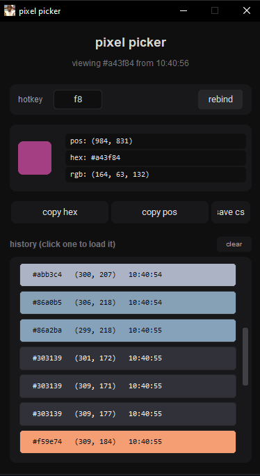

# position-of-ur-screen-color-and-at-what-time

gui tool, press f8 and it shows u the coords of ur cursor, the hex color, rgb values, and the time

[click here to get the app](https://github.com/bufyh/position-of-ur-screen-color-and-at-what-time/releases)

all python

