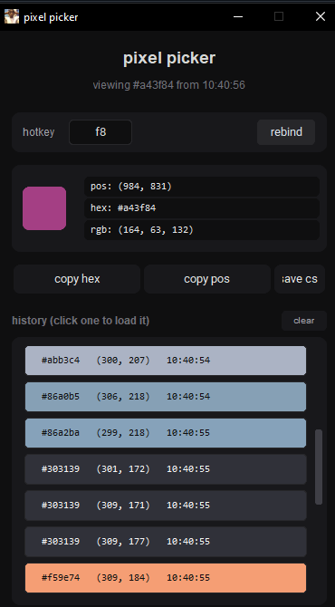

it just opens up a gui u can say and it shows u when u press f8 the cords of that position hex color and the rgb thingy aswell as time idk why but its good really useful
[click this to get the app](https://github.com/bufyh/position-of-ur-screen-color-and-at-what-time/releases/tag/colorpicker)
the keybind is f8    i might later switch the keybind to be customisable with a gui or something  its all python

